# Create Get Pictures Service with Flask
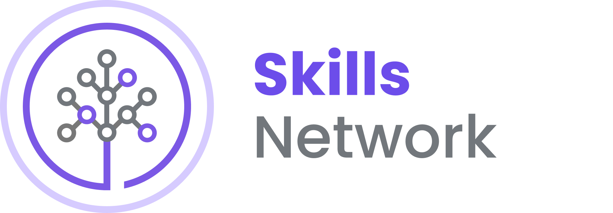

**Estimated time needed**: 90 minutes

Welcome to the **Create Get Pictures Service with Flask** hands-on lab. In this lab, you will begin to build the service that you will eventually deploy to IBM Code Engine. The lab provides a GitHub template repository to get you started. The repository also contains python unit tests. You will be asked to complete the code so that it can pass all tests.

## Objectives
In this lab, you will:
* Create a Flask server
* Write RESTful APIs on picture URL
* Check the APIs should pass the given

### Note: Important Security Information
Welcome to the Cloud IDE. This is where all your development will take place. It has all the tools you will need to use, including **Python** and **Flask**.

It is important to understand that the lab environment is ephemeral. It only lives for a short while before it is destroyed. It is imperative that you push all changes made to your own GitHub repository so that it can be recreated in a new lab environment any time it is required. Also, note that this environment is shared and, therefore, not secure. You should not store any personal information, usernames, passwords, or access tokens in this environment for any purpose.

### Your Task
If you haven't generated a GitHub Personal Access Token you should do so now. You will need it to push code back to your repository. It should have repo and write permissions, and be set to expire in 60 days. When Git prompts you for a password in the Cloud IDE environment, use your Personal Access Token instead. Follow the steps in the for detailed instructions.

### Note on Screenshots
Throughout this lab, you will be prompted to take screenshots and save them on your device. You will need these screenshots to either answer graded quiz questions or you will need to upload them as your submission for peer review at the end of this course. Your screenshot must have either the .jpg or .png extension.

To take screenshots, you can either use various free screen-capture tools or your operating system's shortcut keys. For example:
* **Mac**: You can use Shift + Command + 3 (⇧ + ⌘ + 3) on your keyboard to capture your entire screen or Shift + Command + 4 (⇧ + ⌘ + 4) to capture a window or area. The screen grabs will be saved as .jpg or .png files on your Desktop.
* **Windows**: You can capture your active window by pressing Alt + Print Screen on your keyboard. This command copies an image of your active window to the clipboard. Next, open an image editor, paste the image from your clipboard to the image editor, and save the image as a .jpg or .png file.

## Initialize Development Environment
Because the Cloud IDE environment is ephemeral, it may be deleted at any time. The next time you come into the lab, a new environment may be created. Unfortunately, this means that you will need to initialize your development environment every time it is recreated. This shouldn't happen too often as the environment can last for several days at a time, but when it is removed, following is the procedure to recreate it.

### Overview

#### Create new repository from template
1. Click this URL to open the starter code project: [https://github.com/ibm-developer-skills-network/luggb-Back-End-Development-Pictures](https://github.com/ibm-developer-skills-network/luggb-Back-End-Development-Pictures)
2. Use the green **Use this template** button to clone this repository to your private GitHub account.

**Do not use Fork; use the Template button.**

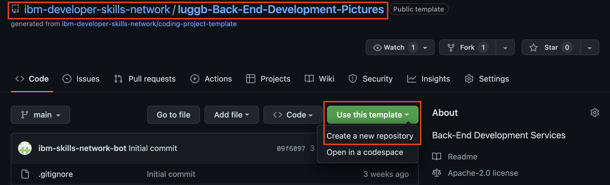

3. Give your repository the name Back-End-Development-Pictures. This is the name that graders will look for to grade your work.
4. Ensure you select the Public option for your repository and then create it.

#### Initialize Development Environment
Each time you need to set up your lab development environment you will need to run three commands. Each command will be explained in further detail, one at a time, in the following section. `{your_github_account}` represents your GitHub account username.

The commands include:
* clone the GitHub repository from your account
* change into the Back-End-Development-Pictures directory
* execute the setup bash script
* exit the terminal

Now, let's discuss each of these commands and explain what needs to be done.

### Task Details
Initialize your environment using the following steps:
1. Open a terminal with `Terminal - New Terminal` if one is not open already.
2. Next, use the export `GITHUB_ACCOUNT` command to export an environment variable that contains the name of your GitHub account.
  - **Note:** Substitute your real GitHub account for the `{your_github_account}` placeholder below:
  ```bash
  export GITHUB_ACCOUNT={your_github_account}
  ```
3. Then use the following commands to clone your repository.
  ```bash
  git clone https://github.com/$GITHUB_ACCOUNT/Back-End-Development-Pictures.git
  ```
4. Change into the devops-capstone-project directory, and execute the ./bin/setup.sh command.
  ```bash
  cd /home/project/Back-End-Development-Pictures
  bash ./bin/setup.sh
  ```
5. You should see the follow at the end of the setup execution:
  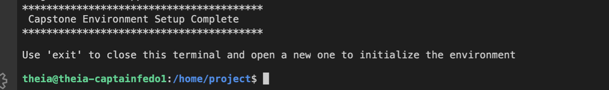

6. Finally, use the exit command to close the current terminal. The environment will not be fully active until you open a new terminal in the next step.
  ```bash
  exit
  ```

### Validate
To validate that your environment is working correctly, you must open a new terminal because the Python virtual environment will only activate when a new terminal is created. Ensure that you have used the exit command to exit the terminal in your previous task.
1. Open a terminal using `Terminal - New Terminal` command. You should see the Python virtual environment (backend-pics-venv) prepended to the terminal prompt. Check that everything is working correctly by using the which python command:
  ```bash
  which python
  ```

You should get back:
  ```bash
  (backend-pics-venv) theia:project$ which python
  /home/theia/backend-pics-venv/bin/python
  ```

Check the Python version:
  ```bash
  python --version
  ```

You should get back some patch level of Python 3.11:
  ```bash
  Python 3.11
  ```

### Evidence
1. Note down the URL of your GitHub repository (not the template) to submit for peer review. Recall the graders are looking for a repository named `Back-End-Development-Pictures` in your account.

This completes the setup of the development environment. Anytime your environment is recreated, you will need to follow the above procedure.

You are now ready to start working.

## Project Overview
Your client has asked you to build a website for a famous band. The backend developer on the project has recently left, and you need to finish the code so the website can go live. The application consists of some different microservices working together.

You are asked in this lab to finish the **Get Pictures** microservice. This microservice stores URLs of pictures from past events. The previous developer started a Python Flask-based REST API and wrote some tests following the TDD or test driven development process. You will need to get the code from GitHub and fill in the missing pieces so that the code can pass all tests.

## REST API Guidelines Review
The architect has provided you the following schema for the endpoints:

#### RESTful API Endpoints
| ACTION | METHOD   | RETURN CODE   | BODY  | URL ENDPOINT      |
|--------|----------|---------------|-------|-------------------|
| List | GET | 200 OK | Array of picture URLs [{...}] | GET `/picture`
| Create | POST | 201 CREATED | A picture resource as json {...} | POST `/picture`
| Read | GET | 200 OK | A picture as json {...} | GET `/picture/{id}`
| Update | PUT | 200 OK | A picture as json {...} | PUT `/picture/{id}`
| Delete | DELETE | 204 NO CONTENT | "" | DELETE `/picture/{id}`

The following end points were completed by the previous developer and can be used for reference:

| ACTION | METHOD   | RETURN CODE   | BODY  | URL ENDPOINT      |
|--------|----------|---------------|-------|-------------------|
| Health | GET      | 200 OK        | ""    | GET `/health`     |
| Health | GET      | 200 OK        | ""    | GET `/health`     |
| Count  | GET      | 200 OK        | ""    | GET `/count`      |
| Count  | GET      | 200 OK        | ""    | GET `/count`      |

## Exercise 1: Test health and count endpoints
Before you implement the Get Pictures API, let's first test the two endpoints that the previous developer implemented.
* `/health`
* `/count`

One way to test the endpoint is to start the server and then use the curl command to send a request to the endpoints. Open the terminal if you don't have it open already and change into the `` directory.
  ```bash
  cd /home/project/Back-End-Development-Pictures
  ```

Next, run the following command to run the flask server in development mode:
  ```bash
  flask --app app run --debugger --reload
  ```

Since your main applicaiton is in a file called app.py, you don't have to specify it. The following command has the same result:
  ```bash
  flask run --debugger --reload
  ```

You should see the flask server running with the following output in the terminal:
  ```bash
  $ flask --app app run --debugger --reload
  * Serving Flask app 'app'
  * Debug mode: off
  WARNING: This is a development server. Do not use it in a production deployment. Use a production WSGI server instead.
  * Running on http://127.0.0.1:5000
  Press CTRL+C to quit
  * Restarting with stat
  * Debugger is active!
  * Debugger PIN: 132-341-814
  ```

You can now execute the following curl command to see the output from the health and the count endpoints. **Use the split button in the terminal to create another terminal next to the one running the server.** You will need to change back into the correct directory before running the command:
  ```bash
  cd /home/project/Back-End-Development-Pictures
  ```

Execute the following commands:
  ```bash
  curl --request GET --url http://localhost:5000/health
  ```
and
  ```bash
  curl --request GET --url http://localhost:5000/count
  ```

You should see the following results: 

`/health`
  ```bash
  $ curl --request GET --url http://localhost:5000/health
  {"status":"OK"}
  ```

`/count`
  ```bash
  $ curl --request GET --url http://localhost:5000/count
  {"length":10}
  ```

A second and preferred way to test code during development is by following the TDD method. As mentioned earlier, the previous developer has written the tests for the code. You can use the pytest command and see if the code passes the tests. It should pass for the `/count` and `/health` endpoints.

### Your Task
1. Run the pytest command to run two tests for the health and count endpoints. You can use the following command:
  ```bash
  pytest -k 'test_health or test_count'
  ```

You should see the following output:
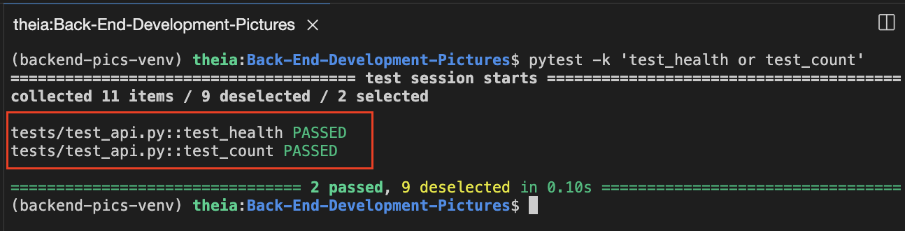

If you run the pytest command without the -k flag, it will run all the tests, and you will see the other tests fail. You use the -k flag to trim the output to just the two endpoint tests.

### Evidence
1. Run the pytest command listed above and take a screenshot of the terminal. There is no need to add the red boxes. Save the screenshot as `exercise1-count-health-passing.jpg` (or `.png`). The screenshot should show the two tests as passed.

Congratulations! You have just completed your first story.

## Exercise 2: Implement the GET /picture endpoint
It is now time to implement the rest of the endpoints. If you run the pytest command now, you will see 9 tests as failed. Your output might look a little different than the screenshot as we have removed all the logs of the fiailing tests for brevity.
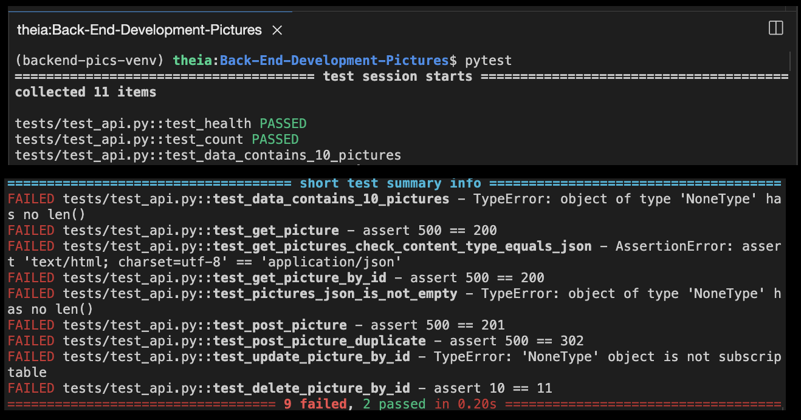
Your task for the rest of the lab is to complete the remaining code to pass the failed tests. Let's start with the GET `/picture` endpoint first.

### Your Task
Before you write the code for the endpoint, let's create a branch so you can commit your code back to GitHub.

#### Task 1: Create a Branch
Since you are working in branches, you must pull the latest changes from the main branch to stay up to date. You can then create a new branch.

Change into the Back-End-Development-Pictures directory and execute the following steps:
  ```bash
  cd /home/project/Back-End-Development-Pictures
  git checkout main
  git pull
  git checkout -b backend-rest
  ```

This will switch to the main branch, pull the latest changes, and create a new branch. You will be asked to push all your changes to your GitHub repo and merge all code back into your main branch with a pull request.

### Task 2: Finish the code for the endpoint
You will write all the code in the `Back-End-Development-Pictures/backend/routes.py` file.

**Note:** To open in File Explorer, go to this location: `Back-End-Development-Pictures/backend/routes.py`

1. Create a Flask route that responds to the GET method for the endpoint `/picture`.
2. Create a function called `get_pictures()` to hold the implementation.
3. The URLs are loaded into a list called data. You need to return it in this method.
4. Run pytest until the following functions pass:
  ```bash
  tests/test_api.py::test_health PASSED
  tests/test_api.py::test_count PASSED
  tests/test_api.py::test_data_contains_10_pictures PASSED
  tests/test_api.py::test_get_picture PASSED
  tests/test_api.py::test_get_pictures_check_content_type_equals_json
  ```

### Evidence
1. Once the functions pass, take a screenshot of the passing functions and name it as `exercise2-get-pictures-passing.jpg` (or `.png`).

Congratulations! You just added the first REST endpoint to your backend.

## Exercise 3: Implement the GET /picture/id endpoint
As before, you will write the code for the endpoint in the `./backend/routes.py` file.

**Note:** To open in File Explorer, go to this location: `Back-End-Development-Pictures/backend/routes.py`

1. Create a Flask route that responds to the GET method for the endpoint `/picture/<id>`.
2. Create a function called `get_picture_by_id(id)` to hold the implementation.
3. The URLs are loaded into a list called data. You will need to parse through the list, find the URL with the given id, and return it back to the caller.
4. Run pytest until the following functions pass:
  ```bash
  tests/test_api.py::test_health PASSED
  tests/test_api.py::test_count PASSED
  tests/test_api.py::test_data_contains_10_pictures PASSED
  tests/test_api.py::test_get_picture PASSED
  tests/test_api.py::test_get_pictures_check_content_type_equals_json PASSED
  tests/test_api.py::test_get_picture_by_id PASSED
  tests/test_api.py::test_pictures_json_is_not_empty PASSED
  ```

Congratulations! You just added the second REST endpoint to your backend.

## Exercise 4: Implement the POST /picture endpoint
As before, you will write the code for the endpoint in the `./backend/routes.py` file.

**Note:** To open in File Explorer, go to this location: `Back-End-Development-Pictures/backend/routes.py`

1. Create a Flask route that responds to the POST method for the endpoint `/picture/<id>`. Use the `methods=["POST"]` in your app decorator.
2. Create a function called `create_picture()` to hold the implementation.
3. You will first need to extract the picture data from the request body and then append it to the data list.
4. If a picture with the id already exists, send an HTTP code of `302` back to the user with a message of `{"Message": "picture with id {picture['id']} already present"}`.
5. Run pytest until the following functions pass:
  ```bash
  tests/test_api.py::test_health PASSED
  tests/test_api.py::test_count PASSED
  tests/test_api.py::test_data_contains_10_pictures PASSED
  tests/test_api.py::test_get_picture PASSED
  tests/test_api.py::test_get_pictures_check_content_type_equals_json PASSED
  tests/test_api.py::test_get_picture_by_id PASSED
  tests/test_api.py::test_pictures_json_is_not_empty PASSED
  tests/test_api.py::test_post_picture {'id':200, 'pic_url':'http://dummyimage.com/230x100.png/dddddd/000000', 'event_country':'United States', 'event_state':'California', 'event_city':'Fremont', 'event_date':'11/2/2030'} PASSED
  tests/test_api.py::test_post_picture_duplicate {'id':200, 'pic_url':'http://dummyimage.com/230x100.png/dddddd/000000', 'event_country':'United States', 'event_state':'California', 'event_city':'Fremont', 'event_date':'11/2/2030'} PASSED
  ```

### Evidence
1. Once the functions pass, take a screenshot of the passing functions and name it as `exercise4-post-picture-passing.jpg` (or `.png`).

## Exercise 5: Implement the PUT /picture endpoint
The PUT endpoint will be used to update an existing picture resource. As before, you will write the code for the endpoint in the `./backend/routes.py` file.

**Note:** To open in File Explorer, go to this location: `Back-End-Development-Pictures/backend/routes.py`

1. Create a Flask route that responds to the POST method for the endpoint `/picture/<int:id>`. Use the `methods=["PUT"]` in your app decorator.
2. Create a function called `update_picture(id)` to hold the implementation.
3. You will first need to extract the picture data from the request body.
4. You will then find the picture in the data list. If the picture exists, you will update it with the incoming request.
5. If the picture does not exist, you will send back a status of `404` with a message `{"message": "picture not found"}`.
6. Run pytest until the following functions pass:
  ```bash
  tests/test_api.py::test_health PASSED
  tests/test_api.py::test_count PASSED
  tests/test_api.py::test_data_contains_10_pictures PASSED
  tests/test_api.py::test_get_picture PASSED
  tests/test_api.py::test_get_pictures_check_content_type_equals_json PASSED
  tests/test_api.py::test_get_picture_by_id PASSED
  tests/test_api.py::test_pictures_json_is_not_empty PASSED
  tests/test_api.py::test_post_picture {'id':200, 'pic_url':'http://dummyimage.com/230x100.png/dddddd/000000', 'event_country':'United States', 'event_state':'California', 'event_city':'Fremont', 'event_date':'11/2/2030'} PASSED
  tests/test_api.py::test_post_picture_duplicate {'id':200, 'pic_url':'http://dummyimage.com/230x100.png/dddddd/000000', 'event_country':'United States', 'event_state':'California', 'event_city':'Fremont', 'event_date':'11/2/2030'} PASSED
  tests/test_api.py::test_update_picture_by_id PASSED
  ```

## Exercise 6: Implement the DELETE /picture endpoint

### Task 1: Implement the Delete endpoint
The DELETE endpoint is used to delete an existing picture resource. As before, you will write the code for the endpoint in the `./backend/routes.py` file.

**Note:** To open in File Explorer, go to this location: `Back-End-Development-Pictures/backend/routes.py`

1. Create a Flask route that responds to the POST method for the endpoint `/picture/<int:id>`. Use the `methods=["DELETE"]` in your app decorator.
2. Create a function called `delete_picture(id)` to hold the implementation.
3. You will first extract the id from the URL.
4. Next, traverse the data list to find the picture by id. If the picture exists, you will delete the item from the list and return an empty body with a status of HTTP_204_NO_CONTENT.
5. If the picture does not exist, you will send back a status of `404` with a message `{"message": "picture not found"}`.
6. Run pytest until the following functions pass:
  ```bash
  tests/test_api.py::test_health PASSED
  tests/test_api.py::test_count PASSED
  tests/test_api.py::test_data_contains_10_pictures PASSED
  tests/test_api.py::test_get_picture PASSED
  tests/test_api.py::test_get_pictures_check_content_type_equals_json PASSED
  tests/test_api.py::test_get_picture_by_id PASSED
  tests/test_api.py::test_pictures_json_is_not_empty PASSED
  tests/test_api.py::test_post_picture {'id':200, 'pic_url':'http://dummyimage.com/230x100.png/dddddd/000000', 'event_country':'United States', 'event_state':'California', 'event_city':'Fremont', 'event_date':'11/2/2030'} PASSED
  tests/test_api.py::test_post_picture_duplicate {'id':200, 'pic_url':'http://dummyimage.com/230x100.png/dddddd/000000', 'event_country':'United States', 'event_state':'California', 'event_city':'Fremont', 'event_date':'11/2/2030'} PASSED
  tests/test_api.py::test_update_picture_by_id PASSED
  tests/test_api.py::test_delete_picture_by_id PASSED
  ```

### Evidence
1. Once the functions pass, take a screenshot of the passing functions and name it as `exercise6-delete-picture-passing.jpg` (or `.png`).

You should now have all the tests passing as shown in the screenshot here:
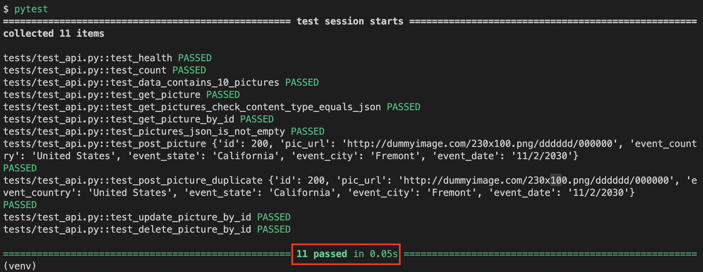

### Task 2: Push the branch to GitHub and create a PR
Now that you have finished the code for the microservice, you can push the backend-rest branch back to your GitHub fork. Since you are the only one working on this project, go ahead and merge the PR and delete the branch. Make sure all your code changes are pushed back to the main branch before proceeding to the next lab.

1. You will be prompted to set up your git user and email the first time you push:
  ```bash
  git config --local user.name "{your GitHub name here}"
  git config --local user.email {your GitHub email here}
  ```
2. Use the `git commit -am` command to commit your changes with the message "implemented pictures service", and the `git push` command to push those changes to your repository.
3. You should see a dialog at the bottom of the screen asking for permission to open GitHub sign in flow. Click on `Allow`.
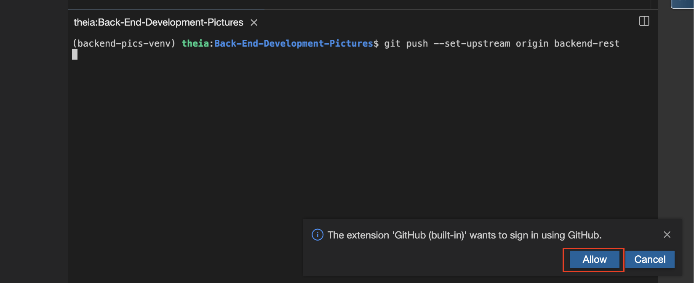
4. The IDE will ask you for your GitHub username and password. Use the token you created in the beginning of the lab as your password.
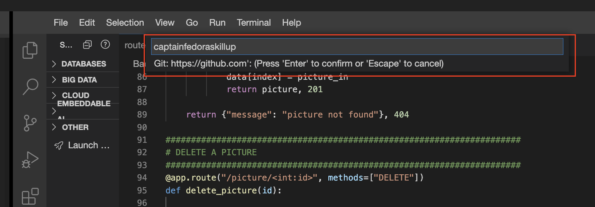
5. You can see the push logs in the terminal if the authentication is successful.
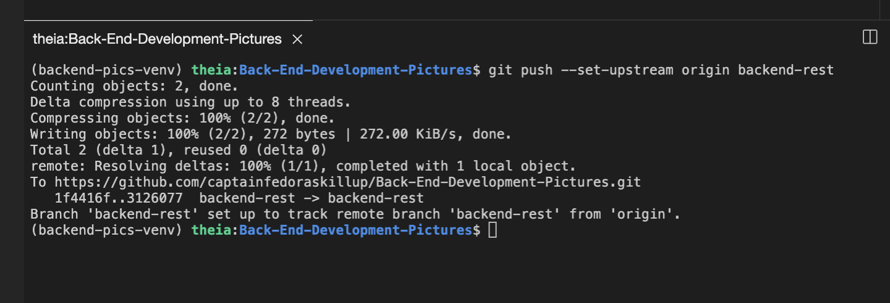
6. Create a pull request on GitHub to merge your changes into the main branch.
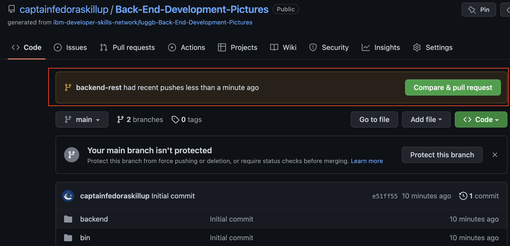
7. Since there is no one else on your team, accept the pull request, merge it, and delete the branch.
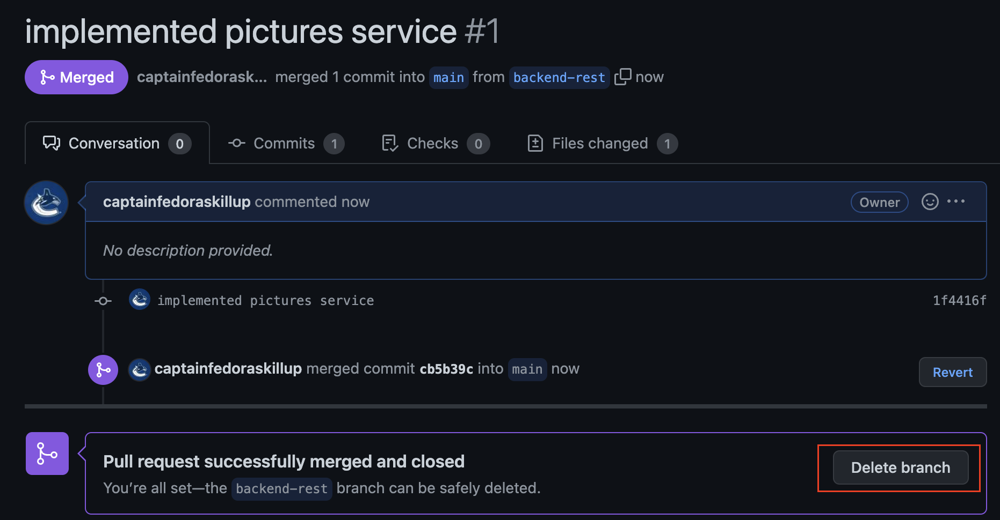
The main branch, at this point, should have your completed code.

## Reference: RESTful Service
Here are some hints on the RESTful behavior of each of the endpoints.

### List
* List should simply send back the list of pictures dict and return the HTTP_200_OK return code. Simply return the `data` structure.
* It should never send back a 404_NOT_FOUND.

### Read
* Read should accept a picture id and traverse through the `data` to find the id.
* It should return an HTTP_404_NOT_FOUND if the picture cannot be found with a message `{"message": "picture not found"}`. 
* If the picture is found, it should return the picture as a Python dictionary with a return code of HTTP_200_OK.

### Create
* Create should accept only requests with the POST method.
* It will look for the picture in the incoming request.
* It should return an HTTP_302_FOUND if the picture already exists in the `data` list.
* Otherwise, it should add the incoming picture to the `data` list and return an HTTP_201_CREATED with a message `{"Message": f"picture with id {picture_in['id']} already present"}`.

### Update
* Update should accept an account_id and HTTP method of PUT.
* It should return an HTTP_404_NOT_FOUND if the picture cannot be found.
* If the picture is found, it should replace the contents of the picture with the one in the request. It should return a code of HTTP_201_CREATED and the updated picture.
* If the picture is not found, it should return a code of HTTP_404_NOT_FOUND and a message `{"message": "picture not found"}`.

### Delete
* Delete should accept a picture id and look for the picture in the `data` list.
* If the picture is not found, it should return a code of HTTP_404_NOT_FOUND and a message `{"message": "picture not found"}`.
* If the picture is found, it should delete the picture from the `data` list.
* It should return an empty string "" with a return code of HTTP_204_NO_CONTENT.

Write the code to make the code pass the test cases as shown above.

## Conclusion
Congratulations! You have finished implementing the first microservice for getting pictures. This microservice will be used by the main site in the final lab for the project.

### Next Steps
You can resume the course at this point. You will be asked to create another microservice in the next module.

### Author(s)
CF

### Changelog
| DATE | VERSION | CHANGED BY | CHANGED DESCRIPTION |
|------|---------|------------|---------------------|
| 2023-02-04 | 0.1 | CF | Initial version created |
| 2023-02-09 | 0.2 | SH | QA pass with edits |